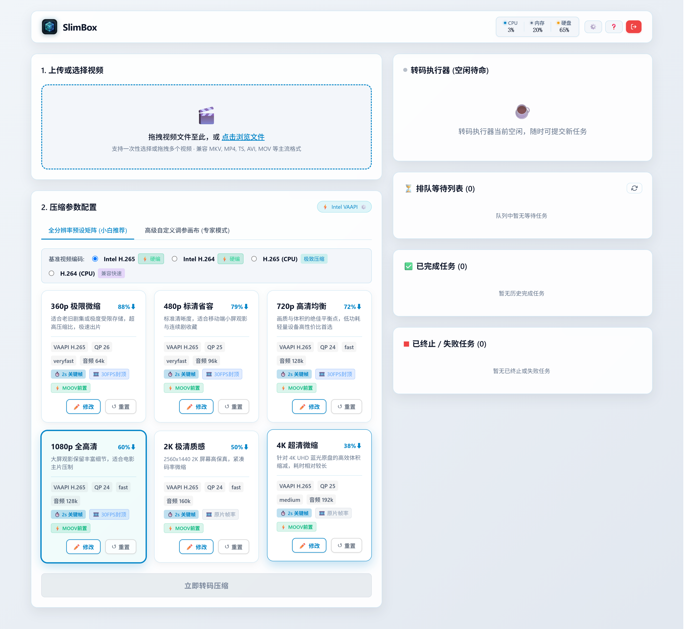

# SlimBox

SlimBox 是一个轻量级视频压缩微服务与命令行工具，支持在低功耗设备（如斐讯 N1、树莓派）及 x86 主机（Intel、AMD、NVIDIA 显卡加速）上部署运行。

通过在后台串行转码，将大体积视频压制为 H.265 或 H.264 格式，在保留全部原始音轨与内嵌软字幕的前提下缩减存储占用。



---

## 功能特性

* **完整音轨与字幕保留**：转码过程中默认保留源视频中的所有音频流（重编码为 AAC），内嵌软字幕采用直通封装（`-c:s copy`），避免字幕丢失或重新渲染。
* **单任务排队调度**：后端严格按 1/1 单任务独占串行调度，避免多任务并发导致低功耗设备或小内存主机出现内存耗尽（OOM）或过热。
* **硬件加速适配**：
  * **x86 平台**：支持 Intel QSV / VAAPI、AMD Mesa VAAPI 以及 NVIDIA NVENC 硬件编码，大幅提升转码速率；
  * **ARM 平台**：多数低功耗 ARM 芯片缺乏通用 H.265 硬件编码器，默认采用 CPU 软编模式，适合长开机、低功耗离线压制。
* **双操作端支持**：
  * **Web 仪表盘**：提供深色控制台，支持文件拖拽上传、进度监控、任务终止与成品下载；
  * **CLI 客户端**：提供跨平台独立可执行文件 `slimbox-cli`，支持对本地目录进行整批视频的自动轮询压制与下载回传。
* **残片即时回收**：若转码任务中途被手动终止或因文件损坏异常退出，系统自动清理 `.part` 临时文件，避免占用磁盘空间。

---

## 镜像版本选择

SlimBox 提供针对不同硬件架构与显卡驱动的专用 Docker 镜像：

| 镜像 Tag | 目标 CPU 架构 | 驱动与特性说明 | 适用硬件与场景 |
| :--- | :--- | :--- | :--- |
| **`:arm64`** | `linux/arm64` | 基础 Alpine + FFmpeg，纯 CPU 软解软编，无冗余 x86 驱动 | 斐讯 N1、树莓派等 ARM64 设备 |
| **`:intel`** | `linux/amd64` | 集成 Intel Media Driver 与 Libva 驱动 | Intel 4~14 代核显（如 N100、i3/i5）及 Arc 独显 |
| **`:amd`** | `linux/amd64` | 集成 Mesa VAAPI 驱动 | AMD 锐龙 APU 核显（如 5600G、7840HS）及 Radeon 独显 |
| **`:nvidia`** | `linux/amd64` | 基于 Debian 构建，包含 NVENC 运行时（需 nvidia-container-toolkit） | 配备 NVIDIA 独立显卡的主机 |
| **`:latest`**<br>(alias: `:standard`) | `linux/amd64` | 同时包含 Intel 与 AMD VAAPI 驱动 | x86 通用开箱即用版本 |

---

## 部署方法

### 1. 使用 Docker Compose 部署（推荐）

创建 `docker-compose.yml` 文件：

```yaml
services:
  slimbox:
    image: crpi-tyyqcg8a2rpatesk.cn-shanghai.personal.cr.aliyuncs.com/zixidaxian/slimbox:latest
    container_name: slimbox
    restart: unless-stopped
    ports:
      - "8080:8080"
    volumes:
      # 系统盘目录：存放数据库与应用配置
      - /opt/docker/slimbox/data:/data
      # 外部存储目录：存放上传的源视频与转码成品
      - /mnt/usbdata/slimbox/uploads:/data/uploads
      - /mnt/usbdata/slimbox/outputs:/data/outputs
    # 若宿主机支持 Intel 或 AMD 硬件加速，取消以下设备映射注释：
    # devices:
    #   - /dev/dri:/dev/dri
    environment:
      - TZ=Asia/Shanghai
      - PORT=8080
      - SLIMBOX_DATA_DIR=/data
      - SLIMBOX_AUTH_ENABLED=true
      - SLIMBOX_ADMIN_PASSWORD=
    logging:
      driver: "json-file"
      options:
        max-size: "10m"
        max-file: "3"
```

在同级目录下启动服务：
```bash
docker compose up -d
```

### 2. 使用 Docker Run 部署

```bash
docker run -d \
  --name slimbox \
  --restart unless-stopped \
  -p 8080:8080 \
  -v /opt/docker/slimbox/data:/data \
  -v /mnt/usbdata/slimbox/uploads:/data/uploads \
  -v /mnt/usbdata/slimbox/outputs:/data/outputs \
  -e TZ=Asia/Shanghai \
  -e PORT=8080 \
  -e SLIMBOX_DATA_DIR=/data \
  -e SLIMBOX_AUTH_ENABLED=true \
  --device /dev/dri:/dev/dri \
  crpi-tyyqcg8a2rpatesk.cn-shanghai.personal.cr.aliyuncs.com/zixidaxian/slimbox:latest
```

### 3. 原生独立运行版（Windows / macOS）

除了容器化部署，SlimBox 亦提供适用于桌面与轻量服务器的原生可执行版本，无需安装 Docker。

#### Windows 版
* **硬件加速**：自动识别并支持 NVIDIA (NVENC)、Intel (QSV) 与 AMD (AMF) 显卡编码加速；
* **主要组件**：
  * `slimbox.exe`：核心服务程序。支持控制台直接运行，或执行 `slimbox.exe service install` 注册为 Windows 系统后台自启服务；
  * `slimbox-tray.exe`：系统托盘常驻助手，支持存储路径选取并一键调用默认浏览器打开 Web 控制台；
  * `slimbox-cli.exe`：命令行批量转码工具；
* **启动运行**：双击运行 `slimbox-tray.exe`，或在 PowerShell / CMD 中执行 `.\slimbox.exe`。

#### macOS 版（Apple Silicon）
* **硬件加速**：原生调用 M 系列芯片的 VideoToolbox 媒体引擎（`hevc_videotoolbox`），兼顾高转码吞吐与低 CPU 占用；
* **存储支持**：支持指定外部存储挂载路径（如 `/Volumes/ExternalDrive/slimbox`），降低内置 SSD 擦写损耗；
* **启动运行**：在终端赋予执行权限后运行 `./slimbox-darwin-arm64`，访问 `http://localhost:8080` 即可。

---

## 密码配置与重置

SlimBox 内置安全鉴权模块（当 `SLIMBOX_AUTH_ENABLED=true` 时启用）。

### 1. 首次启动初始化密码

若未在环境变量中预设密码，服务首次启动时会在控制台生成一个 6 位一次性 PIN 码：

1. 查看容器日志中的 PIN 码：
   ```bash
   docker compose logs | grep PIN
   ```
   输出示例：
   ```text
   [Security] Single-use Web Setup PIN: >>> 648291 <<<
   ```
2. 打开 Web 界面（`http://<主机IP>:8080`），在初始化弹窗中输入该 6 位 PIN 码，并设定管理员主密码。

### 2. 重置管理员密码

若遗忘管理员密码，无需重建数据库：

1. 在 `docker-compose.yml` 的 `environment` 中指定新密码：
   ```yaml
   environment:
     - SLIMBOX_AUTH_ENABLED=true
     - SLIMBOX_ADMIN_PASSWORD=your_new_password
   ```
2. 重新加载容器：
   ```bash
   docker compose up -d
   ```
   服务启动时将自动校验并将主密码重置为指定值。

### 3. 关闭身份验证（免密运行）

在受信任的单人局域网环境下，可将鉴权关闭：
```yaml
environment:
  - SLIMBOX_AUTH_ENABLED=false
```

---

## 使用说明

### 1. Web 界面操作

1. 浏览器访问 `http://<主机IP>:8080`；
2. 拖拽视频文件至上传区域；
3. 选择压缩目标预设档位（如 720p H.265 或 1080p H.265）；
4. 点击加入排队队列，系统将自动依次执行转码；
5. 转码完成后，在已完成列表中点击即可直接播放或下载成品文件。

### 2. CLI 命令行批量操作

`slimbox-cli` 可在本地 PC 或 Mac 上直接运行，自动将本地视频批量推送到服务端转码并同步回传成品：

```bash
# 批量处理本地目录
slimbox-cli batch -s "http://192.168.1.100:8080" \
                  -d "/path/to/source_videos" \
                  -o "/path/to/compressed_output" \
                  --profile 720p

# 查看服务端转码队列状态
slimbox-cli status -s "http://192.168.1.100:8080"

# 中止指定转码任务
slimbox-cli abort -s "http://192.168.1.100:8080" --task-id <TASK_ID>
```

---

## 编译与构建

若需从源码自行编译各平台单机程序（Windows、macOS、Linux），或自行构建指定硬件平台的 Docker 镜像，请参阅：
* [SlimBox 编译与构建指南](docs/build_guide.md)

---

## 开源协议

本项目采用 [MIT License](LICENSE) 协议开源。

